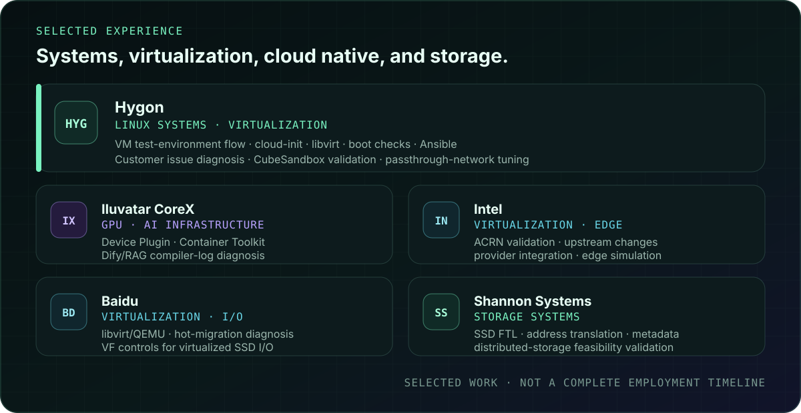
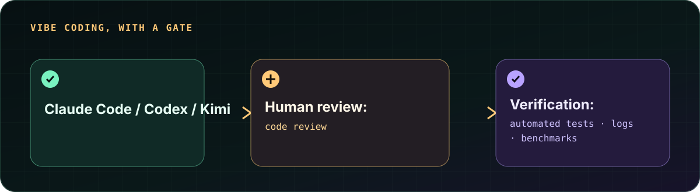
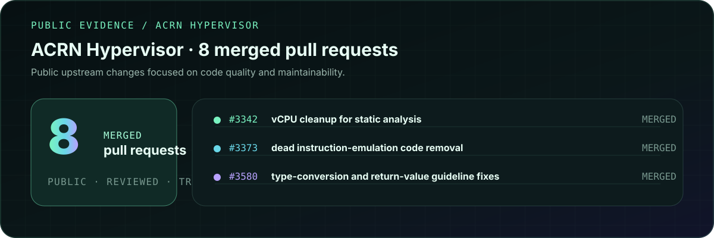
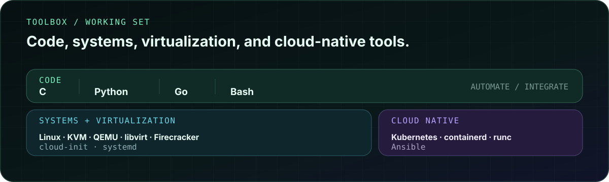

<picture>
  <source media="(max-width: 640px)" srcset="./assets/hero-mobile.svg" />
  
</picture>

<samp>Linux systems · Virtualization · Cloud Native · Vibe Coding</samp>

### [Explore the interactive system map →](https://huix-shh.github.io/huix-shh/)

## What I work on

I work across the system stack: Linux internals and automation, virtual-machine infrastructure, and cloud-native runtime integration. AI coding tools are part of the workflow, but generated changes still pass through human review and executable verification.

## Selected experience

<picture>
  <source media="(max-width: 640px)" srcset="./assets/experience-mobile.svg" />
  
</picture>

Text version and details

- **Hygon** — Contributed to a repeatable VM test-environment flow around image preparation, cloud-init, libvirt, boot checks, and Ansible; also handled customer issue diagnosis. Additional validation: comparable CubeSandbox runs and passthrough-network tuning; one single-port, one-way test result reached 130+ Gbps.
- **Iluvatar CoreX** — Developed GPU Device Plugin and Container Toolkit components; built a Dify/RAG workflow for compiler-log retrieval and assisted diagnosis.
- **Intel** — Contributed to ACRN validation, code quality, and upstream changes; implemented infrastructure-provider integrations and Kubernetes-managed edge simulations.
- **Baidu** — Maintained a libvirt/QEMU platform, diagnosed hot-migration failures, and improved VF permission controls for virtualized SSD I/O paths.
- **Shannon Systems** — Implemented SSD FTL address translation and metadata handling; participated in distributed-storage feasibility validation involving ZooKeeper, consistent hashing, and RDMA.

## Vibe Coding, with a gate

<picture>
  <source media="(max-width: 640px)" srcset="./assets/workflow-mobile.svg" />
  
</picture>

Text version

Claude Code / Codex / Kimi 
↓ 
Human review: code review 
↓ 
Verification: automated tests · logs · benchmarks

I use Claude Code, Codex, and Kimi as coding tools. Generated changes go through human review and verification with automated tests, logs, and benchmarks.

## Public work

<picture>
  <source media="(max-width: 640px)" srcset="./assets/public-work-mobile.svg" />
  
</picture>

Inspect representative changes:

- [#3342 — Clean up vCPU code for static analysis](https://github.com/projectacrn/acrn-hypervisor/pull/3342)
- [#3373 — Remove dead instruction-emulation code](https://github.com/projectacrn/acrn-hypervisor/pull/3373)
- [#3580 — Fix type-conversion and return-value coding-guideline violations](https://github.com/projectacrn/acrn-hypervisor/pull/3580)

New public contributions will be added here only after the corresponding PR or commit is inspectable.

## Toolbox

<picture>
  <source media="(max-width: 640px)" srcset="./assets/toolbox-mobile.svg" />
  
</picture>

Text version

- **code:** C · Python · Go · Bash
- **systems:** Linux · KVM · QEMU · libvirt · Firecracker · cloud-init · systemd
- **cloud_native:** Kubernetes · containerd · runc · Ansible

## Connect

